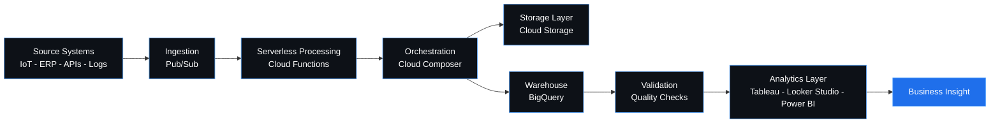
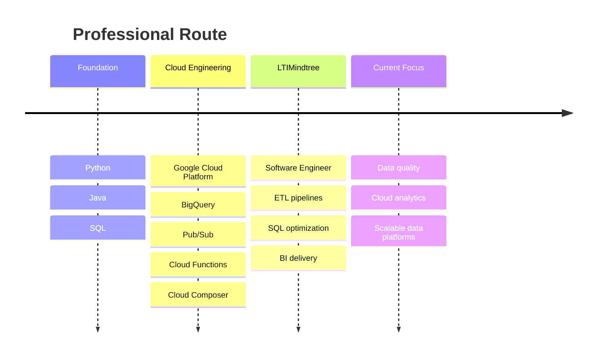
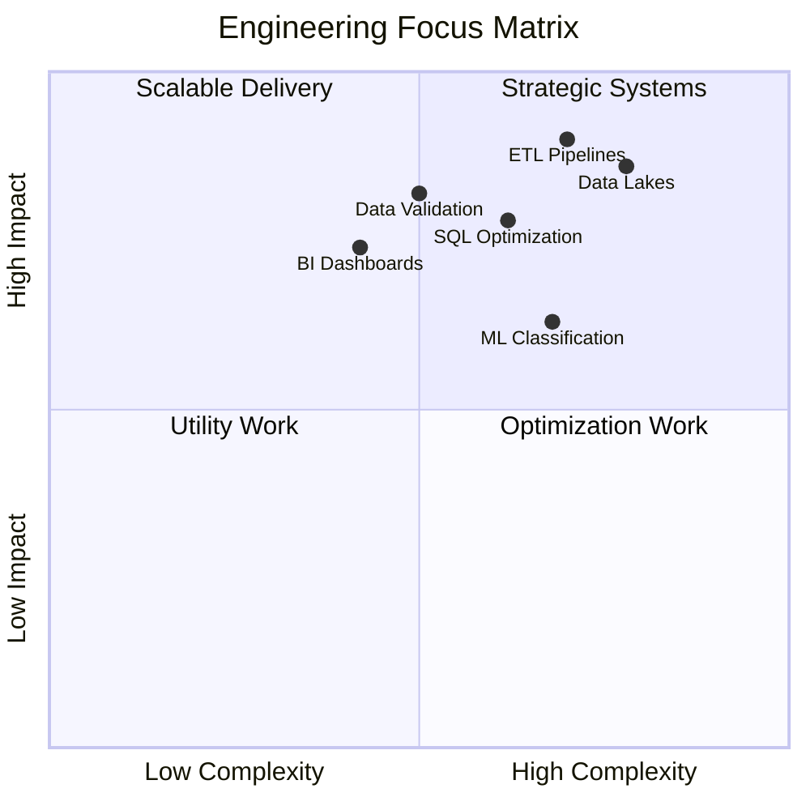

<div align="center">


### Software Engineer | Data Engineer | Google Cloud Platform

Building cloud-native data pipelines, analytics workflows, and reliable data products.

<p>
  <a href="mailto:vkvasudevareddy@gmail.com"></a>
  <a href="https://www.linkedin.com/in/vasudevareddyvk/"></a>
  <a href="Vasudeva_Reddy_Resume.pdf"></a>
  <a href="https://github.com/vvasudevareddy"></a>
</p>


<br/>
<br/>

<p>
  
  
  
  
  
</p>

</div>

---

## Executive Snapshot

```yaml
name: Vasudeva Reddy V K
role: Software Engineer
company: LTIMindtree
specialization: Data Engineering and Cloud Analytics
cloud: Google Cloud Platform
core_strengths:
  - ETL and ELT pipeline development
  - Data warehousing and data lakes
  - SQL optimization
  - Data quality and validation
  - Business intelligence delivery
```

I work on data systems that convert raw, distributed data into clean, reliable, analytics-ready information. My focus is on cloud-native data engineering, scalable pipelines, optimized SQL workflows, and business intelligence systems.

---

## Data Platform Blueprint



---

## Technology Stack

<table>
  <tr>
    <td align="center"></td>
    <td align="center"></td>
    <td align="center"></td>
  </tr>
  <tr>
    <td align="center"></td>
    <td align="center"></td>
    <td align="center"></td>
  </tr>
  <tr>
    <td align="center"></td>
    <td align="center"></td>
    <td align="center"></td>
  </tr>
  <tr>
    <td align="center"></td>
    <td align="center"></td>
    <td align="center"></td>
  </tr>
</table>

---

## Engineering Control Panel

```text
Cloud Data Engineering  [####################] 100%
ETL / ELT Pipelines     [###################.]  95%
SQL Optimization        [##################..]  90%
Data Quality            [##################..]  90%
Business Intelligence   [################....]  80%
Machine Learning        [##############......]  70%
```

---

## Featured Projects

<table>
  <tr>
    <td width="50%">
      <h3>Aircraft Fleet Reliability Data Lake</h3>
      <p>Cloud-native aviation analytics platform focused on fleet reliability, optimized BigQuery workloads, and dashboard-ready data.</p>
      <p>
        
        
        
      </p>
      <ul>
        <li>Designed a scalable aviation data lake on Google Cloud Platform.</li>
        <li>Used BigQuery partitioning and clustering for performance and cost control.</li>
        <li>Supported fleet monitoring and reliability analytics workflows.</li>
      </ul>
    </td>
    <td width="50%">
      <h3>Aerospace Supply Chain and IoT Pipeline</h3>
      <p>Serverless analytics pipeline for aerospace supply chain and IoT-style event data processing.</p>
      <p>
        
        
        
      </p>
      <ul>
        <li>Built ETL workflow using Pub/Sub, Cloud Functions, and Cloud Composer.</li>
        <li>Unified multiple enterprise data sources into BigQuery.</li>
        <li>Automated transformation stages for analytics-ready output.</li>
      </ul>
    </td>
  </tr>
  <tr>
    <td width="50%">
      <h3>Dog Breed Image Classification</h3>
      <p>Deep learning project using CNN-based image classification with PyTorch, VGG16, and ResNet18.</p>
      <p>
        
        
        
      </p>
      <ul>
        <li>Implemented image classification workflow using PyTorch.</li>
        <li>Worked with CNN, VGG16, and ResNet18 model architectures.</li>
        <li>Reached 93%+ classification accuracy through tuning and evaluation.</li>
      </ul>
    </td>
    <td width="50%">
      <h3>Enterprise Data Workflows</h3>
      <p>Production-oriented ETL, SQL optimization, data validation, quality checks, and BI delivery.</p>
      <p>
        
        
        
      </p>
      <ul>
        <li>Built and maintained enterprise-scale ETL pipelines.</li>
        <li>Worked on optimized SQL for analytical workloads.</li>
        <li>Improved reliability through validation and quality controls.</li>
      </ul>
    </td>
  </tr>
</table>

---

## Experience Timeline



### Software Engineer - LTIMindtree

`May 2025 - Present`

- Building and maintaining enterprise-scale ETL pipelines
- Writing optimized SQL for analytical workloads
- Designing cloud-native data engineering workflows on GCP
- Supporting data validation, quality checks, and BI delivery
- Improving pipeline performance, reliability, and cloud cost efficiency

---

## Certifications and Achievements

<table>
  <tr>
    <td width="50%">
      <h3>Certifications</h3>
      <ul>
        <li>Google Cloud Associate Data Practitioner</li>
        <li>LTIMindtree Agile Practitioner</li>
        <li>SQL for Data Science</li>
        <li>Python for Data Science</li>
        <li>AWS Cloud Practitioner Course</li>
      </ul>
    </td>
    <td width="50%">
      <h3>Achievements</h3>
      <ul>
        <li>IEEE Research Publication</li>
        <li>UPSC NDA/NA Selection</li>
        <li>Code Crackers Runner-Up</li>
        <li>Academic Excellence Award</li>
      </ul>
    </td>
  </tr>
</table>

---

## Workflow Matrix



---

## Operating Mode

```text
Input      -> raw operational data, logs, event streams, source tables
Process    -> ingestion, transformation, orchestration, validation
Storage    -> Cloud Storage, BigQuery, warehouse-ready schemas
Output     -> dashboards, reports, analytics, decision-ready datasets
Principle  -> reliable data beats noisy data
```

---

<div align="center">

### Clean pipelines. Reliable data. Useful insights.


</div>
